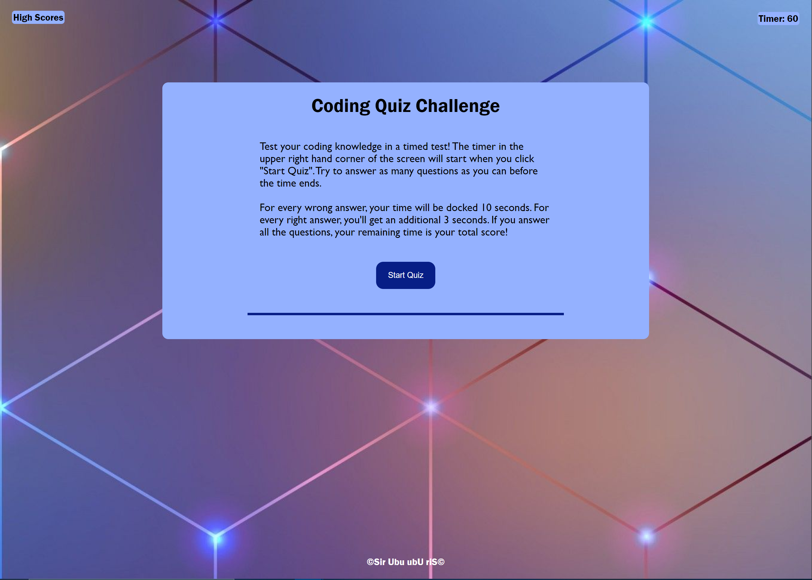

# Code Quiz

Test your HTML, CSS, and JavaScript knowledge in this timed coding quiz!

## Description

Once you click the "Start Quiz" button, you will be met with a question and the timer will start counting down.

The questions are multiple choice or true/false. 

If you select the correct answer, more time is added to your timer.
If you select the incorrect answer, time is taken away from your timer.

If the timer runs out, you can log your score of 0....
If you complete all questions, your remaining time will be your score and you can log it.

Scores are maintained via `localStorage`.
This application uses vanilla JavaScript to manipulate the DOM.

## ScreenShot

## Link
https://sirubu.github.io/code-quiz/